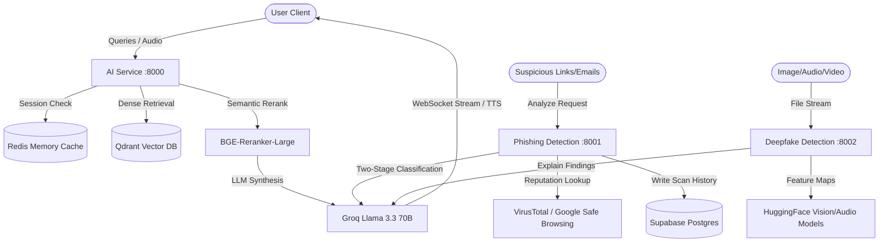
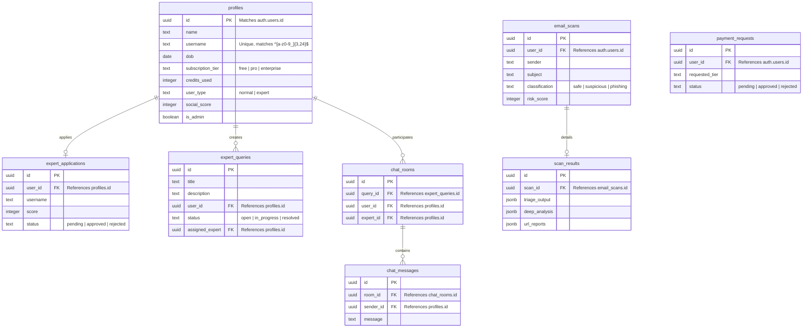

# NorthStar — AI-Powered Cybersecurity Platform

<div align="center">

[](https://react.dev/)
[](https://fastapi.tiangolo.com/)
[](https://www.docker.com/)
[](https://supabase.com/)
[](https://qdrant.tech/)
[](https://redis.io/)
[](https://groq.com/)

**🏆 Built at IndiaHacks 2026 · 2nd Runner Up**

*NorthStar is a full-stack cybersecurity orchestration platform that combines real-time threat intelligence, AI-driven malware/phishing analyses, audio/visual deepfake detection, dynamic prompt injection defenses, and user anomaly logs into a single, integrated console.*

</div>

---

## Table of Contents
1. [System Architecture](#system-architecture)
2. [Microservices & Core Modules](#microservices--core-modules)
3. [Database Schema & Security](#database-schema--security)
4. [Environment Configuration Reference](#environment-configuration-reference)
5. [Getting Started](#getting-started)
   - [Prerequisites](#prerequisites)
   - [Docker Compose Quickstart](#docker-compose-quickstart)
   - [Manual Local Setup (Development)](#manual-local-setup-development)
6. [Project Structure](#project-structure)
7. [Licensing & Acknowledgments](#licensing--acknowledgments)

---

## System Architecture

NorthStar uses a modular, event-driven microservices architecture communicating via REST APIs and WebSockets. The system state and user accounts are managed through Supabase and Postgres triggers, while local caching and high-speed search leverage Redis and Qdrant respectively.

### Architecture Topology

```
                  ┌─────────────────────────────────────────────────┐
                  │                 React Frontend                  │
                  │        (Vite + Tailwind + Supabase Auth)        │
                  └────────────────────────┬────────────────────────┘
                                           │
         ┌─────────────────────────────────┼────────────────────────┐
         │ (HTTP / WS)                     │ (HTTP)                 │ (HTTP)
         ▼                                 ▼                        ▼
   ┌──────────┐                      ┌──────────┐             ┌──────────┐
   │AI Service│                      │ Phishing │             │Deepfake  │
   │  :8000   │                      │  :8001   │             │  :8002   │
   └────┬─────┘                      └────┬─────┘             └────┬─────┘
        │                                 │                        │
        │                                 │                        │
        ├──────────────┐                  │                        │
        ▼              ▼                  ▼                        ▼
  ┌──────────┐   ┌──────────┐      ┌────────────┐            ┌──────────┐
  │  Qdrant  │   │  Redis   │      │  Supabase  │◄───────────┤  Login   │
  │ (vector) │   │ (memory) │      │ (Postgres) │            │ Anomaly  │
  └──────────┘   └──────────┘      └────────────┘            │  :8005   │
                                          ▲                  └────┬─────┘
                                          │                       │ (Alerts)
                                          │                       ▼
                                          │                 ┌──────────┐
                                          │                 │ Telegram │
                                          │                 │   Bot    │
                                          │                 └──────────┘
   ┌──────────────┐                       │
   │ Vulnerable   ├───────────────────────┤
   │   Demo App   │                       │
   │    :8004     │                       │
   └──────┬───────┘                       │
          │ (HTTP Gateway Middleware)     │
          ▼                               │
   ┌──────────────┐                       │
   │ Prompt Guard ├───────────────────────┘
   │    :8003     │
   └──────────────┘
```

### Data & Retrieval Streams



---

## Microservices & Core Modules

NorthStar is powered by six backend microservices and two dedicated database-level systems:

### 1. AI Security Assistant (`ai-service` | Port `8000`)
* **LangGraph Pipeline:** Orchestrates queries through specialized router, retrieval, and synthesis states.
* **Hybrid Retrieval:** Employs Qdrant dense vector search combined with local BM25 keyword matching.
* **Semantic Reranking:** Filters the top 20 candidate chunks down to the top 5 most relevant documents using `bge-reranker-large`.
* **Voice Capabilities:** Features low-latency speech-to-text (STT) via Groq Whisper and speech synthesis (TTS) powered by ElevenLabs.
* **Session Cache:** Uses Redis to store conversation transcripts and context windows (24-hour TTL).

### 2. Phishing & Link Analyzer (`phishingdetection` | Port `8001`)
* **Threat Scans:** Resolves redirects and checks domains against Google Safe Browsing and VirusTotal APIs.
* **Two-Stage LLM Evaluation:** Triages requests using Llama 3.1 8B, and routes suspicious results to Llama 3.3 70B for behavioral auditing.
* **Database Logs:** Automatically records scans and analysis breakdowns directly to Supabase schemas.

### 3. Deepfake & Synthetic Media Detector (`deepfake-service` | Port `8002`)
* **Multi-Modal Detection:** Validates images, video sequences, and audio streams against HuggingFace transformers.
* **Reasoning Engine:** Passes detection anomalies and confidence scores to a Groq LLM to synthesize readable diagnostic explanations.

### 4. Prompt Injection Guard (`prompt-guard-service` | Port `8003`)
* **LLM Middleware:** Intercepts outgoing LLM calls to prevent jailbreaks, prompt leaks, and indirect context hijacking.
* **Heuristics + Classifier:** Combines fast token rules with a localized LLM classifier.

### 5. Login Anomaly Detector (`login-anomaly-service` | Port `8005`)
* **Behavior Auditing:** Matches incoming user sessions against past geographic coordinates, device strings, and timestamps.
* **Telegram Notification Integration:** Immediately triggers a Telegram bot broadcast payload to administrators or affected users when critical location mismatch indexes are exceeded.

### 6. Vulnerable Sandbox App (`vulnerable-demo` | Port `8004`)
* **Educational Playground:** Simulates insecure configurations (SQLi, System Prompt Leaks) protected by the Prompt Guard service.

### 7. Subscription & Tier Management
* **Dynamic Access Tiers:** Limits resources based on user tier (`free`, `pro`, `enterprise`).
* **Request System:** Users request tier elevations; requests are logged in `payment_requests` for manual admin review.

### 8. Community Expert Forum
* **Q&A Directory:** Normal users submit security questions (`expert_queries`).
* **Expert Onboarding:** Verified candidates apply (`expert_applications`). Once approved by an admin, their profile switches to `expert`.
* **Live Chat Rooms:** When an expert accepts a query, an atomic Postgres function (`accept_query`) closes the public thread and opens a secure chat room (`chat_rooms`). Resolving a query increments the expert's `social_score` (+1).

---

## Database Schema & Security

Security is enforced at the database level using Supabase PostgreSQL **Row Level Security (RLS)**.



### Key RLS Policies

* **`profiles`**: Users can select and edit only their own rows. Admins can update any profile (e.g. to modify subscription tiers or set expert roles).
* **`chat_rooms` & `chat_messages`**: Accessible **only** to the user who posted the query and the expert assigned to it.
* **`expert_applications`**: Users can submit applications; admins retain exclusive read/write access.
* **`payment_requests`**: Users can read and insert their own requests. Admins can read all and update status.

---

## Environment Configuration Reference

To run the platform, create `.env` files in each service directory. Below is a detailed mapping of required variables:

| Path | Variable Name | Purpose | Example Value |
|---|---|---|---|
| **`ai-service/.env`** | `GROQ_API_KEY_MAIN` | API Key for primary synthesis LLM | `gsk_Xyz...` |
| | `GROQ_API_KEY_STT` | API Key for Whisper Speech-To-Text | `gsk_Abc...` |
| | `GROQ_API_KEY_ROUTER` | API Key for quick query routing | `gsk_Def...` |
| | `ELEVENLABS_API_KEY` | API Key for voice generation TTS | `sk_eleven...` |
| | `QDRANT_HOST` | Hostname for Vector DB (use `qdrant` in docker) | `qdrant` / `localhost` |
| | `REDIS_HOST` | Hostname for Redis Cache (use `redis` in docker) | `redis` / `localhost` |
| **`phishingdetection/.env`** | `GROQ_API_KEY_TRIAGE` | API Key for fast link triaging | `gsk_Ghi...` |
| | `GROQ_API_KEY_DEEP` | API Key for detailed deep auditing | `gsk_Jkl...` |
| | `SUPABASE_URL` | Supabase endpoint URL | `https://your-proj.supabase.co` |
| | `SUPABASE_SERVICE_KEY` | Secret service role key (bypasses RLS) | `eyJhbGci...` |
| | `VIRUSTOTAL_API_KEY` | Public or Premium VirusTotal scan key | `vt_key...` |
| | `GOOGLE_SAFE_BROWSING_KEY` | Google Developer Console API Key | `google_key...` |
| **`deepfake-service/.env`** | `HF_API_TOKEN` | HuggingFace Token for pipeline models | `hf_Mno...` |
| | `GROQ_API_KEY` | Explainer LLM API Key | `gsk_Pqr...` |
| **`prompt-guard-service/.env`** | `GROQ_API_KEY` | Classifier LLM API Key | `gsk_Stu...` |
| **`login-anomaly-service/.env`** | `SUPABASE_URL` | Supabase endpoint URL | `https://your-proj.supabase.co` |
| | `SUPABASE_SERVICE_ROLE_KEY` | Secret service role key (bypasses RLS) | `eyJhbGci...` |
| | `TELEGRAM_BOT_TOKEN` | Token generated from BotFather | `123456:ABC-DEF` |
| | `TELEGRAM_CHAT_ID` | Recipient ID for anomaly alert payloads | `987654321` |
| **`vulnerable-demo/.env`** | `GROQ_API_KEY` | Chat API key for the insecure page | `gsk_Vwx...` |
| | `PROMPT_GUARD_URL` | Endpoint of the Prompt Guard service | `http://prompt-guard:8003` |
| **`frontend/.env`** | `VITE_SUPABASE_URL` | Public Supabase endpoint URL | `https://your-proj.supabase.co` |
| | `VITE_SUPABASE_ANON_KEY` | Public Anon/Client Key | `eyJhbGci...` |
| | `VITE_AI_SERVICE_URL` | HTTP endpoint of the AI Assistant | `http://localhost:8000` |
| | `VITE_AI_SERVICE_WS_URL` | WebSocket endpoint of the AI Assistant | `ws://localhost:8000/ws/chat` |

---

## Getting Started

### Prerequisites

* **Docker & Docker Compose** installed locally.
* **Node.js (v18+)** and `npm` installed (for manual frontend development).
* A **Supabase Project** with DB Migrations initialized.

---

### Docker Compose Quickstart

The project contains two Docker Compose files. One runs the core system, while the other launches the vulnerabilities and anomaly demonstration environments.

#### 1. Setup Environment Configuration
Run the following helper commands from the project root to copy all templates:
```bash
cp ai-service/.env.example ai-service/.env
cp phishingdetection/.env.example phishingdetection/.env
cp deepfake-service/.env.example deepfake-service/.env
cp login-anomaly-service/.env.example login-anomaly-service/.env
cp prompt-guard-service/.env.example prompt-guard-service/.env
cp vulnerable-demo/.env.example vulnerable-demo/.env
cp frontend/.env.example frontend/.env
```
> [!IMPORTANT]
> Edit the created `.env` files and paste your corresponding API credentials before continuing.

#### 2. Start Core Stack
Build and run the Vector DB, Caches, AI Assistant, Phishing Analyzer, and Deepfake Detector:
```bash
docker compose up --build -d
```

#### 3. Start Demonstration Stack
Build and run the Prompt Guard middleware, Vulnerable Sandbox App, and Login Anomaly Monitor:
```bash
docker compose -f docker-compose.demo.yml up --build -d
```

#### 4. Run the Client Frontend
```bash
cd frontend
npm install
npm run dev
```
Open your browser to `http://localhost:5173`.

---

### Manual Local Setup (Development)

If you are developing or modifying specific microservices, you can run them outside Docker containers.

#### 1. Supabase Schema Migration
Ensure your local or remote Supabase instance has migrations applied:
```bash
# Apply migrations sequentially using your preferred database manager or the Supabase CLI
supabase db push
```

#### 2. Vector DB & Cache Daemon
Ensure Qdrant and Redis are running:
```bash
docker compose up qdrant redis -d
```

#### 3. Run individual Python services
For example, to run the **AI Security Assistant**:
```bash
cd ai-service
python -m venv venv
source venv/bin/activate
pip install -r requirements.txt
uvicorn main:app --host 0.0.0.0 --port 8000 --reload
```

---

## Project Structure

```text
IndiaNext/
├── ai-service/                # RAG chatbot core (FastAPI)
│   ├── config/                # Settings loader & schema limits
│   ├── core/                  # WebSocket connection lifecycle
│   ├── graph/                 # LangGraph Agent StateGraph definitions
│   ├── routes/                # Ingest & WebSocket chat endpoints
│   ├── services/              # Embedding, Reranking, STT/TTS modules
│   └── guide.md               # Detailed PDF ingestion guides
├── phishingdetection/         # Phishing URL & Email scanning service (FastAPI)
│   ├── config/                # API credentials & safe listings
│   ├── routes/                # Analysis triggers & scan history endpoints
│   └── services/              # Two-stage Groq triage + VT check utilities
├── deepfake-service/          # Image/Video/Audio deepfake detector (FastAPI)
│   ├── audio_detector.py      # Audio speech forensics models
│   ├── image_detector.py      # Visual artifact detection models
│   ├── video_processor.py     # Frame extraction & face alignment
│   └── explainer.py           # Natural language explainability generator
├── prompt-guard-service/      # API gatekeeping middleware (FastAPI)
├── login-anomaly-service/     # Geographical anomaly monitoring (FastAPI)
├── vulnerable-demo/           # Educational playground application (FastAPI)
├── frontend/                  # React Single-Page Application (Vite + Tailwind)
│   ├── src/
│   │   ├── components/        # Modals, Input bars, Auth Choice items
│   │   ├── pages/             # Layout components (Chat, Landing, Expert Dashboard, Admin)
│   │   └── services/          # Client interfaces for Supabase, Auth, and WebSockets
├── supabase/                  # PostgreSQL migrations & functions
│   └── migrations/            # Table schemas, RLS rules, and SECURITY DEFINER RPCs
├── docker-compose.yml         # Compose configuration for Core Stack
└── docker-compose.demo.yml    # Compose configuration for Demonstration Stack
```

---

## Licensing & Acknowledgments

* **Competition:** Organized by KES Shroff College at **IndiaHacks 2026**.
* **Team Credits:** Developed in 24 hours under intense competition guidelines.
* **Open Source:** Licensed under the MIT License. Feel free to use, audit, and expand this platform.

---
<div align="center">
Made with ❤️ by the NorthStar Team.
</div>
